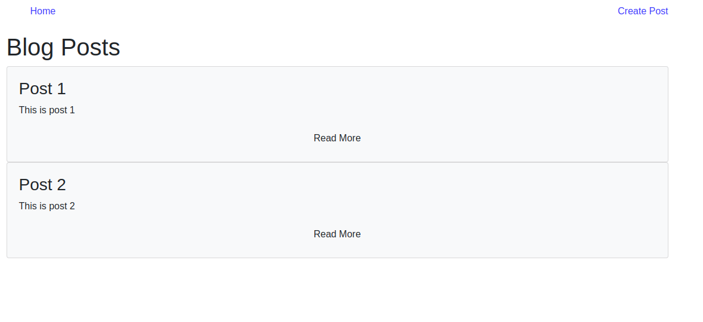

 

# Ruby-On-Rails-Training-App (Blog)

This App was built by following a YouTube tutorial. It is only for study purposes. You can check out the video [here](https://www.youtube.com/watch?v=pPy0GQJLZUM).

In this project I:

- Used Ruby on Rails to implement a Blog App;
- Used HTML and Bootstrap to create the view pages;
- Set up a code linter in the repository;
- Used Github flow;
- Have an organized project structure;
- Used common Ruby patterns.

# What it does

When the App is executed, you can make comments to the posts there. Also, if you have access to the blog, you can create new posts. If you have access, you should use your username and password to login, just ask me and I will send you your information!

## Built with

Ruby on Rails, HTML and Bootstrap.

## Getting Started

- Clone the project to your local machine;
- `cd` into the project directory;
- Run `bundle install` to install the necessary gems;
- Run `rails s` in your terminal to start the server;
- Type 'http://localhost:3000/' in your browser's address field.

## Author

Murilo Roque Paiva da Silva

Github: [@MuriloRoque](https://github.com/MuriloRoque)

Twitter: [@MuriloRoquePai1](https://twitter.com/MuriloRoquePai1)

Linkedin: [MuriloRoque](https://www.linkedin.com/in/murilo-roque-b1268741/)

## Author 2

Aremu Lucky Baba

Github: [@Luckyaremu](https://github.com/Luckyaremu)

Twitter: [@Luckyaremu](https://twitter.com/luckyaremu)

Linkedin: [@Luckyaremu](https://www.linkedin.com/in/lucky-aremu-24807a145/)

## 🤝 Contributing

Contributions, issues and feature requests are welcome! Start by:

- Forking the project
- Cloning the project to your local machine
- `cd` into the project directory
- Run `git checkout -b your-branch-name`
- Make your contributions
- Push your branch up to your forked repository
- Open a Pull Request with a detailed description to the development branch of the original project for a review

## Show your support

Give a ⭐️ if you like this project!

## Acknowledgments

The original design is attributed to [Brad Traversy](https://github.com/bradtraversy).
